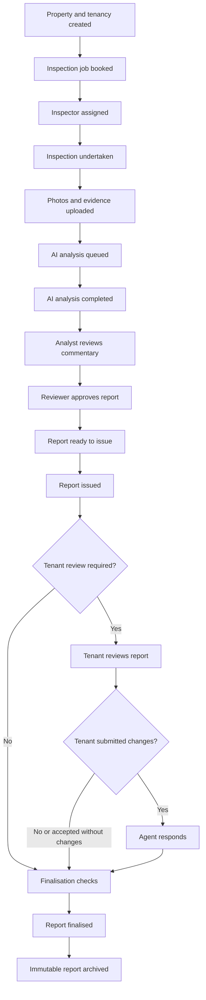

# End-to-End Inspection Business Workflow

## Purpose

This document defines the complete operational workflow for creating, analysing, reviewing, issuing, responding to, finalising and archiving property inspection reports.

It is the product contract for:

- workflow states and state transitions
- user responsibilities and permissions
- automated system actions
- validation gates
- exception and recovery paths
- notifications and audit events
- report-type variations
- implementation requirements for the shared inspection engine

The workflow applies to:

1. Entry Property Condition Reports
2. Routine Inspection Reports
3. Exit Inspection Reports
4. Inspection Comparison Reports
5. Maintenance and Follow-Up Reports

See [Inspection Type Requirements](inspection-types.md) for the evidence, commentary, validation and output requirements that apply to each report type.

---

# 1. Workflow principles

## 1.1 One shared workflow engine

The application must use one configurable workflow engine rather than hard-coded page-specific status changes.

Each workflow transition must define:

- source state
- destination state
- permitted actor roles
- required data and validation rules
- system actions
- audit events
- notifications
- rollback or exception path
- report-type applicability

## 1.2 Server-authoritative transitions

The browser may request a transition, but it must not directly determine or write the final workflow state.

Every transition must be validated by the backend against:

- authenticated user
- agency membership
- assigned role
- property and tenancy access
- current job and report versions
- required evidence
- required approvals
- transition-specific business rules

## 1.3 No silent state changes

Every material state change must create an immutable audit event containing:

- event ID
- agency ID
- property ID
- tenancy ID where applicable
- inspection job ID
- report ID and version where applicable
- previous state
- new state
- actor ID and role
- timestamp
- reason or transition command
- validation result
- relevant task, document or notification IDs

## 1.4 Human accountability remains explicit

AI may assist with:

- image classification
- area and component detection
- commentary drafting
- comparison suggestions
- quality-control checks
- maintenance categorisation

AI must not:

- approve reports
- assign tenant liability
- determine bond deductions
- certify operation without evidence
- overwrite reviewed commentary
- finalise or archive a report without an authorised human action

## 1.5 Report versions are immutable after issue

Draft report content may be edited and versioned.

Once a report is issued:

- the issued version must be immutable
- later corrections must create a new superseding version
- tenant responses must refer to the exact issued version
- finalisation must preserve the issued content, responses and agent decisions

---

# 2. Primary actors

| Actor | Primary responsibilities |
| --- | --- |
| Agency administrator | Configure agency, users, templates, workflow policies and permissions |
| Operations coordinator | Create properties and tenancies, book jobs, assign inspectors and monitor progress |
| Inspector | Conduct inspection, record access limitations, capture evidence and submit inspection work |
| AI analysis service | Process evidence, generate structured observations and draft commentary |
| Analyst | Check evidence, correct AI output, complete commentary and prepare the report for review |
| Reviewer | Independently review evidence, commentary, comparison outcomes and completeness |
| Property manager or issuing agent | Approve issue, manage tenant responses, determine follow-up and authorise finalisation |
| Tenant | Review an issued Entry PCR or other report where tenant participation is enabled |
| Maintenance coordinator | Validate, assign, track and close maintenance actions |
| Archive service | Produce immutable artifacts, hashes, retention metadata and archive confirmation |
| Notification service | Deliver task, deadline, failure and completion notifications |
| System administrator | Manage technical operations without receiving unrestricted business-data access by default |

A user may hold more than one business role, but each action must record the role under which it was performed.

---

# 3. Core business objects

The workflow operates across the following linked objects:

| Object | Purpose |
| --- | --- |
| Agency | Security and operational boundary |
| User profile | Identity, agency membership, role and status |
| Client | Owner, landlord, managing client or agency relationship |
| Property | Physical property being inspected |
| Tenancy | Tenant and lease context for the property |
| Inspection job | Operational task from booking through completion |
| Report | Editable inspection record and lifecycle container |
| Report version | Immutable snapshot at review, issue and finalisation stages |
| Area | Room or external area included in the inspection |
| Component | Structured item assessed within an area |
| Photo or video | Original evidence and derived media |
| Analysis job | Asynchronous AI-processing record |
| Review decision | Reviewer acceptance, amendment or rejection |
| Tenant response | Tenant agreement, disagreement, comments and evidence |
| Agent response | Agent decision against tenant-submitted differences |
| Maintenance item | Actionable issue extracted from inspection evidence |
| Final document | Generated PDF and structured JSON snapshot |
| Audit event | Immutable record of material activity |

---

# 4. End-to-end workflow map

## 4.1 Primary workflow

## 4.2 Operational swimlane

```mermaid
flowchart LR
    subgraph Operations
        O1[Create property and tenancy]
        O2[Book inspection job]
        O3[Assign inspector]
    end

    subgraph Inspector
        I1[Accept assignment]
        I2[Conduct inspection]
        I3[Upload and classify evidence]
        I4[Submit inspection]
    end

    subgraph Platform
        S1[Validate submission]
        S2[Queue analysis]
        S3[Process AI tasks]
        S4[Run quality checks]
    end

    subgraph Analyst
        A1[Review evidence]
        A2[Edit structured findings]
        A3[Submit for approval]
    end

    subgraph Reviewer
        R1[Review report]
        R2{Changes required?}
        R3[Approve report]
    end

    subgraph IssuingAgent
        P1[Authorise issue]
        P2[Respond to tenant changes]
        P3[Authorise finalisation]
    end

    subgraph Tenant
        T1[Open issued report]
        T2[Review and respond]
        T3[Submit response]
    end

    subgraph Archive
        X1[Generate final artifacts]
        X2[Hash and retain records]
        X3[Confirm archive]
    end

    O1 --> O2 --> O3 --> I1 --> I2 --> I3 --> I4
    I4 --> S1 --> S2 --> S3 --> S4 --> A1 --> A2 --> A3 --> R1 --> R2
    R2 -- Yes --> A1
    R2 -- No --> R3 --> P1 --> T1 --> T2 --> T3 --> P2 --> P3 --> X1 --> X2 --> X3
```

---

# 5. Canonical lifecycle states

The application currently contains related `InspectionJobStatus` and `ReportLifecycleStatus` values. The workflow engine must keep job and report states aligned while recognising that they represent different concerns:

- the inspection job represents operational work
- the report lifecycle represents document maturity and legal or business status

## 5.1 Recommended canonical states

| Stage | Inspection job state | Report lifecycle state | Primary owner |
| --- | --- | --- | --- |
| Property setup | Not yet created | Not yet created | Operations |
| Job drafting | `draft` | Not yet created or `draft` | Operations |
| Job booked | `booked` | `draft` | Operations |
| Inspector assigned | `assigned` | `draft` | Operations / Inspector |
| Inspection in progress | `inspection_started` | `draft` | Inspector |
| Evidence uploading | `photos_uploading` | `draft` | Inspector |
| Evidence submitted | `photos_uploaded` | `photos_uploaded` | Inspector / System |
| Analysis waiting | `analysis_queued` | `analysis_queued` | System |
| Analysis processing | `analysis_running` | `analysis_running` | AI service |
| Analysis exception | `analysis_failed` | `analysis_queued` or failure metadata | System / Operations |
| Analysis complete | `analysis_complete` | `analysis_complete` | System |
| Analyst review | `review_required` | `internal_review` | Analyst |
| Reviewer review | `review_required` | `review_required` | Reviewer |
| Reviewer approved | `reviewer_approved` | `approved_for_issue` | Reviewer |
| Issue preparation | `ready_to_issue` | `approved_for_issue` | Issuing agent |
| Issued | `issued_to_tenant` where applicable | `issued_to_tenant` | Issuing agent |
| Tenant responding | `tenant_viewed` or new response-progress state | `tenant_response_in_progress` | Tenant |
| Tenant submitted | `tenant_submitted` | `tenant_submitted` | Tenant |
| Agent response | New agent-response state recommended | `agent_response_required` | Issuing agent |
| Finalised | `finalised` | `finalised` | Issuing agent |
| Archived | `archived` | `archived` | Archive service |

## 5.2 Additional states recommended for implementation

The existing enums should be extended or supplemented with transition metadata for:

- `inspection_submitted`
- `analyst_review_in_progress`
- `reviewer_review_in_progress`
- `changes_requested`
- `tenant_response_in_progress` on the job where operational tracking requires it
- `agent_response_required` on the job
- `finalisation_ready`
- `on_hold`
- `cancelled`
- `archive_failed`

A generic `failed` status should not replace stage-specific failure metadata. Failures should record the failed stage, attempt count, error category and recovery action.

---

# 6. Detailed workflow stages

## Stage 1: Property and tenancy created

### Responsible roles

- Operations coordinator
- Agency administrator

### Required inputs

- agency
- property address
- property type where known
- client or owner relationship
- tenancy where the report type requires one
- tenant names and contact details where applicable
- lease dates where applicable
- access instructions
- relevant source documents

### Validation gates

- property belongs to the authenticated agency
- no unresolved duplicate property exists at the same address
- tenancy dates are logically valid
- tenant contact data is present where tenant issue or review is required
- active tenancy does not conflict with another active tenancy unless explicitly authorised

### System actions

- create property record
- create or link client record
- create tenancy record where required
- generate audit events
- establish property document and media paths

### Exceptions

- Routine inspections may proceed against an active property while tenancy details are incomplete only where agency policy permits it.
- Comparison-only work may link two historical reports without creating a current tenancy.
- Maintenance follow-up may be created from a report without a new inspection job.

### Exit criteria

The property is active and all report-type-required relationship data exists.

---

## Stage 2: Inspection job booked

### Responsible roles

- Operations coordinator
- Agency administrator
- Authorised integration service

### Required inputs

- property
- tenancy where applicable
- inspection type
- published inspection template version
- scheduled date and time or booking window
- access method
- special instructions
- source report references for Exit and Comparison reports

### Validation gates

- selected template is published and active
- property and tenancy are eligible for the inspection type
- required previous reports exist and are immutable where comparison is mandatory
- no conflicting duplicate active job exists unless authorised

### System actions

- create inspection job with status `booked`
- create draft report and bind the template version
- copy the applicable area and component structure into the report workspace
- create required tasks and booking notifications
- store booking source, including manual, Shopify, API or integration origin

### Exit criteria

A valid job, draft report and template binding exist.

---

## Stage 3: Inspector assigned

### Responsible roles

- Operations coordinator
- Agency administrator

### Required inputs

- active inspector user
- scheduled time or accepted booking window
- required qualifications or agency permissions

### Validation gates

- inspector belongs to the agency or an authorised service provider
- inspector is active
- inspector has access to the property and inspection type
- no prohibited scheduling conflict exists

### System actions

- set `assignedInspectorId`
- move job to `assigned`
- notify inspector
- make the inspection package available for controlled offline download
- record reassignment history rather than overwriting it

### Exceptions

- inspector declines assignment
- job is reassigned
- job is rescheduled
- job is placed on hold
- job is cancelled

### Exit criteria

An active inspector has accepted or is deemed assigned under agency policy.

---

## Stage 4: Inspection undertaken

### Responsible role

- Inspector

### Start transition

`assigned` to `inspection_started`

### Required inspection activities

- confirm arrival and actual start time
- confirm property identity
- record attendance by tenant or representative where relevant
- record access limitations
- inspect every required area
- assess required components
- capture supporting photographs and videos
- record operational testing only when actually performed
- add additional areas or components where discovered
- record safety or urgent issues immediately

### Validation gates before submission

- every required area has a status
- every required component is assessed, marked not applicable, or supported by an access limitation
- required photographs exist
- exceptions contain commentary
- untested components are not marked as confirmed working
- critical safety issues have been escalated
- required signatures or attendance records are present where configured

### System actions

- preserve local drafts and sync state
- timestamp evidence capture and upload
- maintain an append-only inspection activity log
- run client-side completeness checks without treating them as final authority

### Exceptions

- no access to property
- partial access
- unsafe conditions
- tenant refuses access
- device offline
- inspection paused and resumed
- incorrect property or job

### Exit criteria

The inspector submits the inspection package and declares the field inspection complete.

---

## Stage 5: Photos and evidence uploaded

### Responsible roles

- Inspector
- Upload service

### State progression

`inspection_started` to `photos_uploading` to `photos_uploaded`

### Required evidence processing

- resumable upload of original files
- file type and size validation
- malware and content checks where appropriate
- cryptographic hashing
- duplicate detection
- extraction of capture metadata
- thumbnail and analysis derivative generation
- association with job, report, area and component where known

### Validation gates

- original media is stored successfully
- required file metadata exists
- uploaded file count matches the client upload manifest
- each required area meets minimum evidence rules
- failed uploads are resolved or explicitly waived by an authorised user

### System actions

- mark evidence immutable at the original-object level
- update upload progress
- record missing-evidence warnings
- notify the inspector of unresolved failures
- create `photos_uploaded` audit event only after server confirmation

### Exceptions

- upload interrupted
- duplicate file
- unsupported file
- corrupted media
- upload manifest mismatch
- insufficient photo coverage

### Exit criteria

The server confirms that required evidence is safely stored and available for analysis.

---

## Stage 6: AI analysis queued

### Responsible role

- System

### State progression

`photos_uploaded` to `analysis_queued`

### Preconditions

- evidence validation has passed
- template and prompt versions are available
- report is not locked or cancelled
- an equivalent idempotent analysis job does not already exist

### System actions

- create analysis job
- divide work into area, component, comparison and quality-control tasks
- place tasks in Cloud Tasks
- publish `analysis.queued` event
- store model, prompt, template and schema versions
- display estimated queue position only if it can be calculated reliably

### Exit criteria

At least one durable analysis task exists and can be retried independently.

---

## Stage 7: AI analysis completed

### Responsible roles

- AI analysis service
- System

### State progression

`analysis_queued` to `analysis_running` to `analysis_complete`

### Processing requirements

- classify areas and components
- generate structured observations
- draft evidence-based commentary
- cite supporting media IDs
- generate comparison suggestions where applicable
- generate maintenance candidates
- assign confidence values
- flag unsupported or ambiguous observations
- validate output against the response schema

### Completion gate

Analysis is complete only when:

- all required tasks succeeded or were formally waived
- structured output passed schema validation
- source evidence references are valid
- low-confidence and contradictory findings are flagged
- no task remains permanently unaccounted for

### Failure handling

On failure:

- set job state to `analysis_failed`
- retain successful task results
- record failed task and error category
- retry according to policy
- permit authorised manual continuation after retries are exhausted
- never discard inspector-entered data

### Exit criteria

The report contains analysis suggestions ready for human review, or an authorised manual-processing decision exists.

---

## Stage 8: Analyst reviews commentary

### Responsible role

- Analyst

### State progression

`analysis_complete` to `review_required` with report state `internal_review`

### Required activities

- verify area and component matching
- compare commentary against photographs
- correct material, colour, quantity and type descriptions
- correct cleanliness, condition and working-status classifications
- remove unsupported claims
- resolve low-confidence findings
- confirm missing or inaccessible evidence statements
- validate maintenance candidates
- complete comparison findings where applicable
- ensure wording complies with the approved commentary rules

### Validation gates

- all required components have a review decision
- every defect has evidence or a documented limitation
- no operational claim lacks a testing basis
- AI suggestions are accepted, amended or rejected
- required maintenance items are classified
- comparison conclusions are supported by both source reports

### Rework path

The analyst may return specific areas to the inspector when:

- evidence is missing
- an area is incorrectly identified
- critical observations are ambiguous
- additional clarification is required

Returning work must not erase existing evidence or commentary.

### Exit criteria

The analyst submits a complete report version for independent review.

---

## Stage 9: Reviewer approves report

### Responsible role

- Reviewer

### State progression

`review_required` to either:

- `changes_requested`, returning to analyst review; or
- `reviewer_approved`, with report state `approved_for_issue`

### Required activities

- review report completeness
- sample or fully review supporting evidence according to policy
- review all exception, damage, cleanliness and not-working findings
- review all Entry-to-Exit or other comparison changes
- verify maintenance recommendations
- verify report-specific mandatory sections
- confirm tenant-response configuration
- confirm the correct template version

### Approval gates

- no unresolved mandatory validation errors
- no unresolved reviewer comments
- all high-risk or critical findings reviewed
- final issue version created
- issuer and tenant recipient details available where required

### Separation-of-duties rule

Agency policy may prevent the same user from acting as both analyst and reviewer for the same report. The workflow engine must support this as a configurable rule.

### Exit criteria

The reviewer records approval against an immutable approved report version.

---

## Stage 10: Report issued

### Responsible role

- Property manager or authorised issuing agent

### State progression

`reviewer_approved` to `ready_to_issue` to `issued_to_tenant` or an equivalent client-issued state for reports without tenant participation.

### Required actions

- confirm recipients
- confirm due date or response deadline
- generate issued PDF and structured snapshot
- assign immutable issue version
- create secure recipient access
- deliver notifications
- store delivery attempts and outcomes

### Validation gates

- report is reviewer approved
- issue version exists
- required recipients exist
- tenant invitation rules are satisfied where applicable
- final issue document generation succeeded
- the issue action is authorised

### Report-type variation

- Entry PCR: normally issued to tenant and requires tenant review.
- Routine Inspection: normally issued to property manager, client or landlord; tenant response is optional.
- Exit Inspection: issued according to agency process; tenant participation may be enabled.
- Comparison Report: issued to authorised internal or client recipients.
- Maintenance Report: issued to authorised operational recipients and service providers according to restricted access rules.

### Exit criteria

The issued artifact is immutable, delivery is recorded and the appropriate response workflow has started or been skipped.

---

## Stage 11: Tenant reviews where applicable

### Responsible role

- Tenant

### State progression

`issued_to_tenant` to `tenant_viewed` and report state `tenant_response_in_progress`

### Tenant capabilities

- view the exact issued version
- agree or disagree at area or component level
- add comments
- upload supporting evidence
- save progress
- submit a final response

### Restrictions

The tenant must not:

- edit agent commentary
- delete agent evidence
- alter the issued report version
- access other properties or tenancies
- change a response after final submission without a controlled reopening event

### System actions

- record first view and later access events
- send configurable reminder notifications
- preserve response drafts
- display the response deadline
- record expiry or extension decisions

### No-response handling

Agency policy must define what occurs when the response deadline passes. The system must record:

- deadline
- reminders sent
- whether access was opened
- whether an extension was granted
- the authorised decision to proceed without a response

The platform must not silently treat no response as agreement.

### Exit criteria

The tenant submits a response, the deadline process is resolved, or tenant review is formally waived where legally and operationally appropriate.

---

## Stage 12: Agent responds

### Responsible role

- Property manager or authorised issuing agent

### State progression

`tenant_submitted` to `agent_response_required`

### Required activities

For each tenant disagreement or addition, the agent must record:

- accepted
- partially accepted
- rejected
- further evidence required
- specialist assessment required
- explanatory response
- any amendment to the final record

### Validation gates

- every tenant-submitted item has a decision
- decisions are linked to evidence
- material report changes create a new controlled version
- tenant content remains preserved
- liability or bond decisions remain outside automated AI conclusions

### Reopening path

A response may be reopened only by an authorised role with:

- reason
- new deadline
- audit event
- notification to affected parties

### Exit criteria

All tenant submissions have a resolved agent response and the report is ready for finalisation.

---

## Stage 13: Report finalised

### Responsible role

- Property manager or authorised finaliser

### Preconditions

- reviewer approval is valid
- issue workflow completed
- tenant workflow completed, waived or expired through an authorised process
- all agent responses are complete
- all required signatures and acknowledgments exist
- no blocking review or generation errors remain

### System actions

- create final report version
- create final PDF
- create structured JSON snapshot
- create evidence manifest
- include template, prompt and model versions where relevant
- include approvals, issue history, tenant response and agent response
- calculate cryptographic hashes
- set job and report to `finalised`
- prevent ordinary editing
- publish `report.finalised` event

### Correction policy

A finalised report must not be edited in place. Corrections require:

- a superseding version
- reason for correction
- authorisation
- links between original and corrected versions
- delivery of the corrected version where required

### Exit criteria

The final report artifacts exist, pass integrity checks and are ready for archival retention.

---

## Stage 14: Immutable report archived

### Responsible roles

- Archive service
- Authorised records administrator for exceptional recovery actions

### State progression

`finalised` to `archived`

### Archived package

The archive package must contain or reference:

- final PDF
- final structured report snapshot
- evidence manifest
- original-media object references and hashes
- tenant response
- agent response
- approval records
- issue and delivery records
- template version
- relevant AI model, prompt and schema versions
- audit-event chain
- retention and destruction metadata

### Validation gates

- all expected artifacts exist
- hashes validate
- archive storage policy is applied
- access controls are verified
- retention metadata is present
- archive confirmation is recorded

### Archive failure

If archival fails:

- the report remains finalised but not archived
- an `archive_failed` operational condition is recorded
- retry is automatic according to policy
- operations receive an alert
- the system must not falsely display the record as archived

### Exit criteria

Archive confirmation exists and the report is read-only except through approved records-management procedures.

---

# 7. Exception and recovery paths

## 7.1 Inspection could not proceed

Possible outcomes:

- reschedule
- reassign
- place on hold
- cancel with reason
- record no-access attempt

The job must retain the original booking and attempt history.

## 7.2 Partial inspection

The inspector may submit a partial inspection only where policy allows it. The report must identify:

- inaccessible areas
- reason
- date and time
- person providing or refusing access where appropriate
- whether a return visit is required

## 7.3 Evidence upload failure

The workflow must support:

- resumable upload
- retries
- upload from another device by an authorised user
- explicit waiver with reason
- prevention of analysis when required evidence remains missing

## 7.4 AI analysis failure

The workflow must support:

- automatic retry
- task-level retry rather than full-report restart
- model or prompt fallback where approved
- manual analyst processing
- preserved successful output

## 7.5 Analyst or reviewer requests changes

Change requests must be component-specific where possible and include:

- requester
- reason
- affected area or component
- required action
- blocking or advisory classification
- resolution status

## 7.6 Report issue failure

If PDF generation, secure-link creation or notification delivery fails:

- the report remains approved but not issued
- failed delivery attempts are visible
- the issuer can retry safely without creating duplicate issue versions

## 7.7 Tenant response overdue

The system must apply agency-configured rules for:

- reminders
- extensions
- escalation
- proceeding without response
- recording the legal or operational basis for the decision

## 7.8 Finalisation failure

If final artifact generation fails:

- no finalised state is recorded
- approved and issued versions remain intact
- retry is idempotent
- operations are alerted

## 7.9 Cancellation

Cancellation must record:

- cancelling actor
- reason
- current workflow stage
- whether the job may be reopened
- whether uploaded evidence must be retained
- notification requirements

Cancellation must not delete the audit history.

---

# 8. Report-type workflow applicability

| Workflow stage | Entry PCR | Routine | Exit | Comparison | Maintenance |
| --- | ---: | ---: | ---: | ---: | ---: |
| Property required | Yes | Yes | Yes | Via source reports | Yes |
| Tenancy required | Yes | Normally | Yes | Where relevant | Where relevant |
| Inspector assignment | Yes | Yes | Yes | Optional | Optional |
| Field inspection | Yes | Yes | Yes | Not always | Not always |
| Photo upload | Comprehensive | Overview and issues | Comprehensive | Source evidence | Issue evidence |
| AI analysis | Supported | Supported | Supported | Core comparison assistance | Categorisation assistance |
| Analyst review | Required | Configurable | Required | Required | Required for issued actions |
| Reviewer approval | Required | Configurable | Required | Required | Configurable by priority |
| Issue to tenant | Required | Usually no | Configurable | Usually no | Instructions only where relevant |
| Tenant response | Required | Optional | Configurable | No unless specifically enabled | No formal report response |
| Agent response | Required when tenant changes submitted | Optional | Configurable | Not normally | Action approval instead |
| Finalisation | Required | Required | Required | Required | Required when issued |
| Immutable archive | Required | Required | Required | Required | Required for issued versions |

---

# 9. Transition permission matrix

| Transition | Permitted roles |
| --- | --- |
| Create property or tenancy | Agency administrator, Operations |
| Book job | Agency administrator, Operations, authorised integration |
| Assign inspector | Agency administrator, Operations |
| Start inspection | Assigned inspector, authorised Operations override |
| Submit inspection | Assigned inspector |
| Waive missing evidence | Reviewer, Property manager, Agency administrator according to policy |
| Queue or retry analysis | System, authorised Analyst or Operations retry command |
| Complete analyst review | Analyst |
| Request review changes | Reviewer |
| Approve report | Reviewer |
| Authorise issue | Property manager, authorised issuing agent |
| Submit tenant response | Authorised tenant linked to tenancy and issue version |
| Respond to tenant changes | Property manager, authorised issuing agent |
| Finalise report | Authorised finaliser, normally Property manager |
| Archive report | Archive service |
| Create superseding correction | Agency administrator or authorised Property manager with reviewer approval |

Permission checks must also enforce agency, property, tenancy, job and assignment scope.

---

# 10. Commands, events and notifications

## 10.1 Recommended transition commands

The backend should expose explicit commands rather than a generic `updateStatus` endpoint.

Examples:

- `CreateInspectionJob`
- `AssignInspector`
- `StartInspection`
- `SubmitInspection`
- `ConfirmEvidenceUpload`
- `QueueAnalysis`
- `RetryAnalysisTask`
- `SubmitAnalystReview`
- `RequestReportChanges`
- `ApproveReport`
- `AuthoriseIssue`
- `RecordTenantView`
- `SubmitTenantResponse`
- `SubmitAgentResponse`
- `AuthoriseFinalisation`
- `ConfirmArchive`
- `CancelInspectionJob`
- `ReopenWorkflowStage`

Each command must be idempotent where retries are possible.

## 10.2 Recommended domain events

- `property.created`
- `tenancy.created`
- `inspection.booked`
- `inspection.assigned`
- `inspection.started`
- `inspection.submitted`
- `evidence.uploaded`
- `analysis.queued`
- `analysis.started`
- `analysis.completed`
- `analysis.failed`
- `analyst_review.completed`
- `review.changes_requested`
- `review.approved`
- `report.ready_to_issue`
- `report.issued`
- `tenant.viewed`
- `tenant.response_submitted`
- `agent.response_completed`
- `report.finalised`
- `report.archive_failed`
- `report.archived`
- `inspection.cancelled`

## 10.3 Notification triggers

| Trigger | Typical recipients |
| --- | --- |
| Job assigned or reassigned | Inspector, Operations |
| Inspection due or overdue | Inspector, Operations |
| Upload incomplete or failed | Inspector, Operations |
| Analysis failed | Analyst, Operations |
| Analyst review ready | Assigned Analyst |
| Reviewer action required | Assigned Reviewer |
| Changes requested | Analyst and Inspector where relevant |
| Report ready to issue | Property manager or issuing agent |
| Report issued | Tenant or configured recipients |
| Tenant deadline approaching | Tenant, Property manager |
| Tenant response submitted | Property manager or issuing agent |
| Finalisation ready | Authorised finaliser |
| Archive failed | Operations, System administrator |
| Report archived | Authorised business recipient where configured |

Deadlines and escalation intervals must be configurable by agency and report type rather than hard-coded.

---

# 11. Google Cloud implementation map

| Workflow responsibility | Recommended Google Cloud component |
| --- | --- |
| Web application | Firebase Hosting |
| Authentication | Identity Platform |
| Authoritative workflow API | Cloud Run |
| Operational records and state | Firestore |
| Original and derived evidence | Cloud Storage |
| Durable analysis and generation tasks | Cloud Tasks |
| Domain-event distribution | Pub/Sub |
| AI processing | Vertex AI through Cloud Run workers |
| Secrets | Secret Manager |
| PDF and archive generation | Cloud Run worker |
| Logs and audit monitoring | Cloud Logging and Cloud Monitoring |
| Container images | Artifact Registry |
| CI/CD | Cloud Build and Cloud Deploy |

The Cloud Run API must own workflow transitions. Firestore triggers may publish or react to events, but they must not become an undocumented second workflow engine.

---

# 12. Workflow data requirements

Every inspection job should store or reference:

- current job status
- status version or optimistic-lock value
- current assigned actor IDs
- scheduled, started, submitted and completed timestamps
- current blocking reasons
- latest successful transition
- latest failed transition
- report ID and current report version
- template version
- tenant-response requirement
- response deadline
- cancellation or hold metadata

Every report should store or reference:

- current lifecycle status
- current editable version
- approved version
- issued version
- final version
- reviewer approval
- issue history
- tenant response status
- agent response status
- finalisation record
- archive record

State should not be inferred solely from page navigation, file presence or loosely related timestamps.

---

# 13. Validation and concurrency rules

## 13.1 Optimistic concurrency

Transitions must reject stale updates when another actor has changed the job or report since the client loaded it.

## 13.2 Idempotency

Commands involving uploads, analysis, issue, notifications, finalisation and archive must accept idempotency keys.

## 13.3 Atomic changes

A material transition should atomically update or coordinate:

- job status
- report lifecycle status
- assignment or task ownership
- transition record
- audit event
- notification request

## 13.4 No skipped mandatory stages

The workflow engine may skip a conditional stage only where the report-type template permits it.

Examples:

- Routine Inspection may skip tenant review.
- Comparison Report may skip field inspection.
- Maintenance Report may begin from an existing report finding.

The reason for the skipped stage must be recorded.

---

# 14. Workflow acceptance criteria

The workflow implementation is complete only when all of the following are true:

1. Every state transition is performed through a server-authoritative command.
2. Invalid transitions are rejected with an actionable reason.
3. Role, agency, property, tenancy and assignment permissions are enforced.
4. Job and report states remain synchronised.
5. Required validation gates prevent incomplete reports from advancing.
6. Offline inspection work can resume and upload safely.
7. Upload, AI, PDF, notification and archive retries are idempotent.
8. Analyst and reviewer changes preserve earlier versions and evidence.
9. Issued and final report versions are immutable.
10. Tenant responses are linked to the exact issued version.
11. No-response decisions are explicit and audited.
12. Finalisation cannot occur while required responses or approvals remain unresolved.
13. Archive failure is visible and recoverable.
14. Every material action creates an immutable audit event.
15. Workflow deadlines and notifications are configurable by agency and report type.
16. Automated tests cover successful, rejected, retried, cancelled and reopened transitions.
17. Cross-agency and privilege-escalation tests pass for every transition endpoint.

---

# 15. Recommended implementation sequence

1. Define the canonical job and report states in the shared domain package.
2. Define transition commands and validation schemas.
3. Add a workflow policy configuration to each published inspection-type template.
4. Implement the Cloud Run workflow command handler.
5. Implement Firestore transactions and immutable audit events.
6. Add assignment, blocking-reason and deadline fields.
7. Implement upload confirmation and analysis orchestration transitions.
8. Implement analyst and reviewer review transitions.
9. Implement issue, tenant-response and agent-response transitions.
10. Implement finalisation and archival transitions.
11. Build role-specific task queues and dashboard views.
12. Add end-to-end workflow and security tests.
13. Migrate existing jobs and reports to the canonical state model.
14. Enable the workflow progressively in development, staging and production.

This workflow is the authoritative operational sequence for the shared inspection platform. Report-type templates may configure conditional stages and validation requirements, but they must not create uncontrolled alternative lifecycle logic.